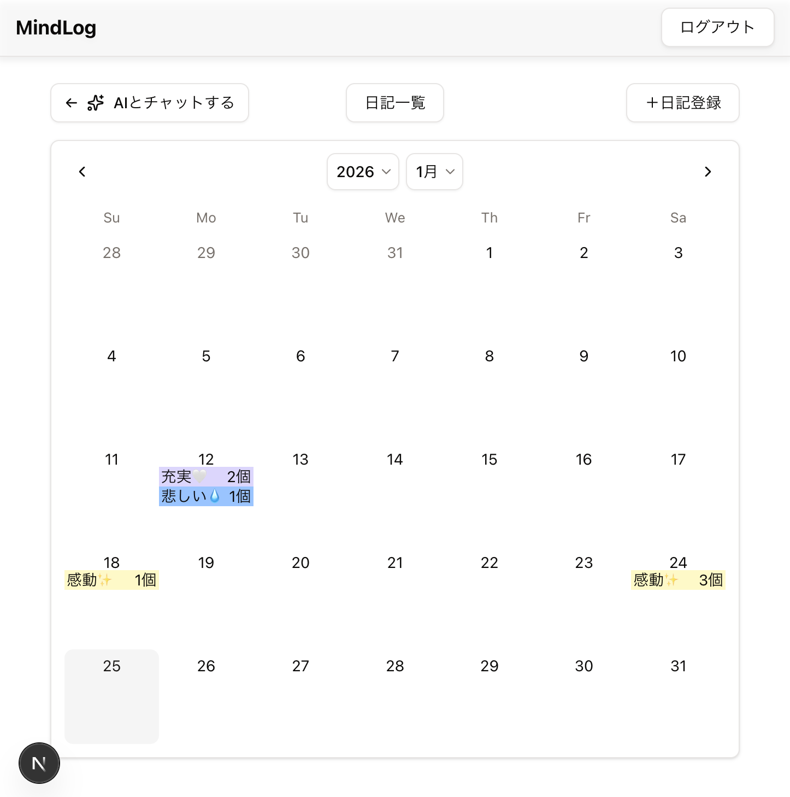
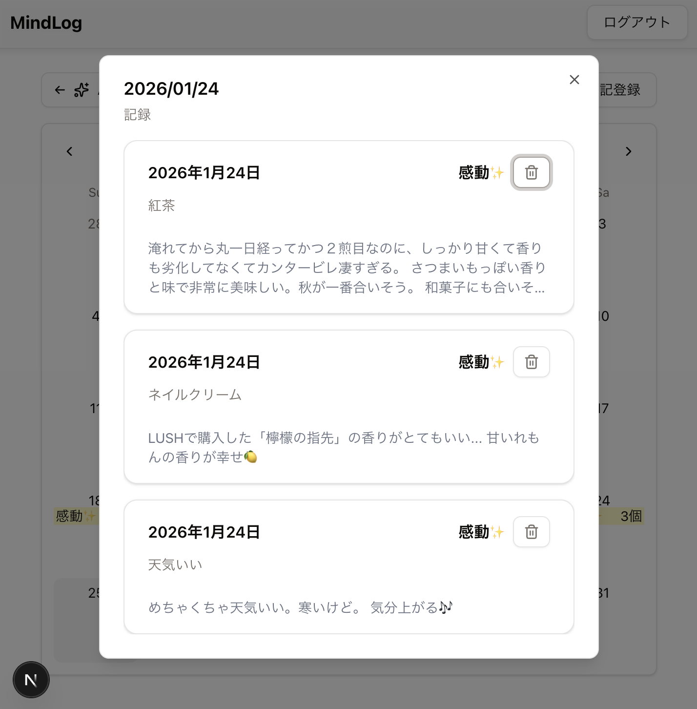
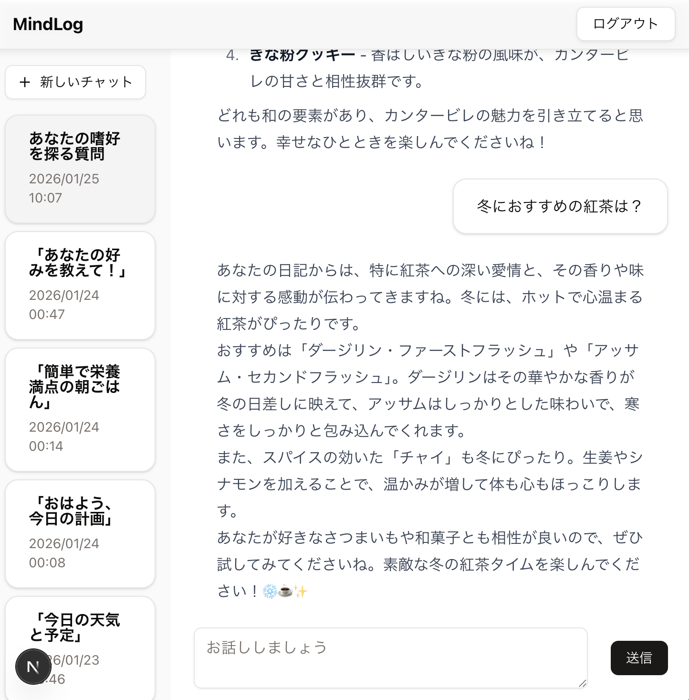

# MindLog

📱 MindLog - AI日記アプリ

## 概要

日々の出来事や気持ちを記録し、AIが利用者の性格や好みを理解して、パーソナライズされたアドバイスを提供する日記アプリ

## デモ

  🔗 **Live Demo**: https://mind-log-frontend.vercel.app

  ### カレンダービュー
  

  ### 日記詳細
  

  ### AIチャット
  

## ターゲットユーザー

  - 自己理解を深めたい人
  - 悩みを相談したい人
  - パーソナライズされた提案が欲しい人

## 主な機能

### 📝 日記機能
  - 日記のCRUD（作成・閲覧・更新・削除）
  - 感情（Feeling）の記録（楽しい、感動、充実、悲しい、怒り、驚き）
  - 日付ごとの日記管理

### 📅 カレンダービュー
  - 月単位でのカレンダー表示
  - 日記がある日を感情（Feeling）に応じた色でマークアップ
  - 同じ日に複数の日記がある場合、複数のドットで表示
  - 日付クリックで該当日の日記一覧をダイアログ表示

### 🤖 AIチャット機能
  - OpenAI APIを使用したパーソナライズされた対話
  - 日記の内容に基づいた提案・アドバイス
  - ストリーミング形式でのレスポンス表示

## 技術スタック

### フロントエンド

- Next.js 16 (App Router)
- React 19
- TypeScript
- Tailwind CSS
- shadcn/ui

### バックエンド

- Hono (API フレームワーク)
- AWS Lambda (Node.js 24 + TypeScript)
- API Gateway
- AWS SAM (アプリケーション層の IaC)

### インフラ

- AWS (Cognito, Lambda, API Gateway, DynamoDB)
- **Terraform + SAM ハイブリッド構成**
  - Terraform: 長期インフラ（Cognito）
  - SAM: アプリケーション層（Lambda, API Gateway, DynamoDB）

### AI

- OpenAI API

## システムアーキテクチャ

  ```mermaid
  graph TB
      subgraph "Frontend"
          A[Next.js on Vercel]
      end

      subgraph "AWS"
          C[API Gateway]
          D[Lambda<br/>Hono API]
          E[DynamoDB<br/>Diaries]
          F[DynamoDB<br/>ChatRooms]
          G[Cognito]
      end

      subgraph "External"
          H[OpenAI API]
      end

      A -->|HTTPS| C
      C --> D
      D --> E
      D --> F
      D --> H
      A -->|Auth| G
      D -->|Auth| G

      style A fill:#f9f,stroke:#333
      style D fill:#bbf,stroke:#333
      style E fill:#bfb,stroke:#333
      style F fill:#bfb,stroke:#333
  ```

## 開発で工夫した点

### フロントエンド
  - **カレンダー表示のパフォーマンス最適化**
    - 日記データのグルーピング処理を最適化
    - カスタムフックで状態管理を分離

  - **shadcn/ui のカスタマイズ**
    - Calendar コンポーネントの DayButton をカスタマイズ
    - 各日付セルに複数の feeling ドットを動的表示

  - **コンポーネント設計**
    - 責任の分離（CalendarView, DiaryDetailDialog, hooks）
    - ユーティリティ関数の切り出し（calendar.ts）

### バックエンド
  - **サーバーレスアーキテクチャ**
    - AWS Lambda + Hono による軽量なAPI実装
    - コールドスタート対策（SAM による最適化）

  - **ストリーミングレスポンス**
    - OpenAI API のストリーミング機能を活用
    - リアルタイムなチャット体験を実現

### インフラ
  - **IaCによる管理**
    - Terraform + SAM のハイブリッド構成
    - 長期インフラ（Cognito）とアプリケーション層（Lambda, API Gateway）を分離管理


## プロジェクト構成

```
MindLog/
├── frontend/        # Next.js フロントエンド
├── backend/         # SAM プロジェクト (Lambda + API Gateway + DynamoDB)
│   ├── src/
│   ├── template.yaml
│   └── samconfig.toml
├── terraform/       # 長期インフラ（Cognito）
└── README.md        # このファイル
```

## デプロイ環境

### フロントエンド
  - **Vercel** (本番環境)
    - Next.js App Router対応
    - 自動デプロイ（main ブランチ）

### バックエンド
  - **AWS Lambda** (開発環境)
    - API Gateway 経由でアクセス
    - SAM によるデプロイ管理

## 今後の改善予定
  - [ ] CI/CD パイプラインの構築
  - [ ] エラーハンドリングの強化
  - [ ] テストコードの追加
  - [ ] 編集機能
  - [ ] 検索・フィルタリング機能
  - [ ] パフォーマンス最適化


## 開発コマンド

### ルートで実行
```bash
# フォーマット
pnpm format
# リント
pnpm lint
```

### バックエンド
```bash
# 型チェック
pnpm type-check
# ビルド
pnpm sam:build:dev
# デプロイ（開発環境）
sam deploy --config-env dev
```

### フロントエンド
```bash
# 開発サーバー起動
pnpm dev
```

### Terraform
```bash
# フォーマット
terraform fmt
# 初期化
terraform init
# 構文チェック
terraform validate
# 変更内容確認&適用
terraform apply
```

## ライセンス

UNLICENSED
